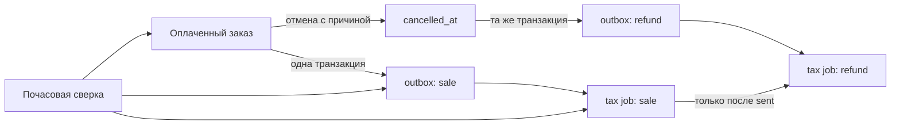

# ADR-0002: Сверка налогового контура и возврат оплаченного заказа

- **Статус:** принято
- **Дата:** 11 августа 2026 года
- **Область:** заказ, основной tax outbox, отдельная tax DB, внешний оператор чеков

## Требования и ограничения

Оплата заказа, складское списание и создание исходного события чека должны оставаться атомарными в основной PostgreSQL. Недоступность tax DB или партнёра не должна блокировать кассу. Потерянные связи между оплаченным заказом, outbox и tax job должны обнаруживаться и по возможности восстанавливаться автоматически.

Отмена оплаченного заказа не должна удалять или переписывать исходную продажу. Она должна создавать отдельную аудируемую операцию возврата. По зафиксированному бизнес-правилу продукты на склад при отмене не возвращаются: фактическое расхождение остаётся видимым в инвентаризационном контуре. Причина возврата обязательна.

## Решение

Приняты следующие правила:

1. Исходная продажа имеет ключ `order:{id}:paid`, возврат — `order:{id}:refund`. Уникальные ключи обеспечивают идемпотентность.
2. Мягкая отмена и запись refund-outbox выполняются в одной транзакции основной БД. Ошибка outbox откатывает отмену.
3. В tax DB каждая задача содержит `operation_type`: `sale` или `refund`. Возврат ссылается на продажу через `original_idempotency_key`.
4. Dispatcher не захватывает refund-задачу, пока исходная sale-задача не получила статус `sent`.
5. Партнёру передаются тип операции, стабильный ключ, причина коррекции и идентификатор исходного чека. В режиме `SAFE` внешняя отправка полностью отключена.
6. Сверка выполняется для текущего и предыдущего операционного дня. Она создаёт отсутствующий outbox, возвращает в очередь ошибочно помеченный `processed` outbox без tax job и фиксирует обнаруженные разрывы в `tax_reconcile_run`/`tax_reconcile_gap`.
7. Автоматическое восстановление не скрывает факт инцидента: обнаружение остаётся в журнале, а разрыв `TAX_JOB_MISSING` считается закрытым только после появления tax job.

## Рассмотренные варианты

### Изменять исходный чек или заказ

Отклонено: теряется финансовая история, усложняется аудит и невозможно безопасно повторить доставку.

### Возвращать продукты на склад при отмене

Отклонено согласно бизнес-правилу. Приготовленные или фактически израсходованные продукты нельзя автоматически считать вернувшимися. Складской факт корректируется только отдельной инвентаризационной операцией.

### Синхронно обращаться к tax DB и партнёру из кассовой транзакции

Отклонено: внешний сбой блокировал бы оплату и создавал распределённую транзакцию без гарантированного атомарного commit.

### Разрешить refund отправляться независимо от sale

Отклонено: при параллельных worker возврат мог бы попасть партнёру раньше исходного чека.

## Отказы и восстановление

- Если tax DB недоступна, кассовая транзакция уже содержит outbox; relay и сверка повторятся по расписанию.
- Если sale не отправлена, refund остаётся `pending` и не захватывается dispatcher.
- Если партнёр возвращает неретраимую ошибку, задача переходит в `manual_required`; сверка создаёт незакрытый gap.
- Если outbox отмечен `processed`, но job отсутствует, сверка безопасно возвращает outbox в `pending`; upsert по ключу исключает дубликат.
- Если приложение падает между отменой и commit, обе записи откатываются вместе.

## Безопасность и эксплуатация

Ручной запуск сверки доступен только `OWNER`. В журнал gap не записываются телефон, адрес, токен или полный payload заказа. Операционные логи содержат только дату и счётчики. Ограничение одного запуска до 5000 заказов защищает API от неограниченной нагрузки; факт усечения отражается в результате.

## Последствия и компромиссы

Решение сохраняет историю и допускает независимые сбои двух БД, но является eventually consistent: refund может ожидать sale. Внешний партнёр должен поддерживать семантику `operationType=refund`; до подтверждения контракта следует использовать `SAFE`, а несовместимый ответ будет виден как `manual_required`. Сверка создаёт дополнительные, но небольшие записи аудита.

## Развёртывание и откат

Миграция tax DB только добавляет столбцы, ограничение и индекс. Старая версия backend игнорирует новые поля. При откате приложения refund-задачи нельзя удалять; внешнюю отправку следует оставить в `SAFE`, затем развернуть исправленную версию. Предпочтителен forward-fix, поскольку удаление событий разрушает финансовую историю.
